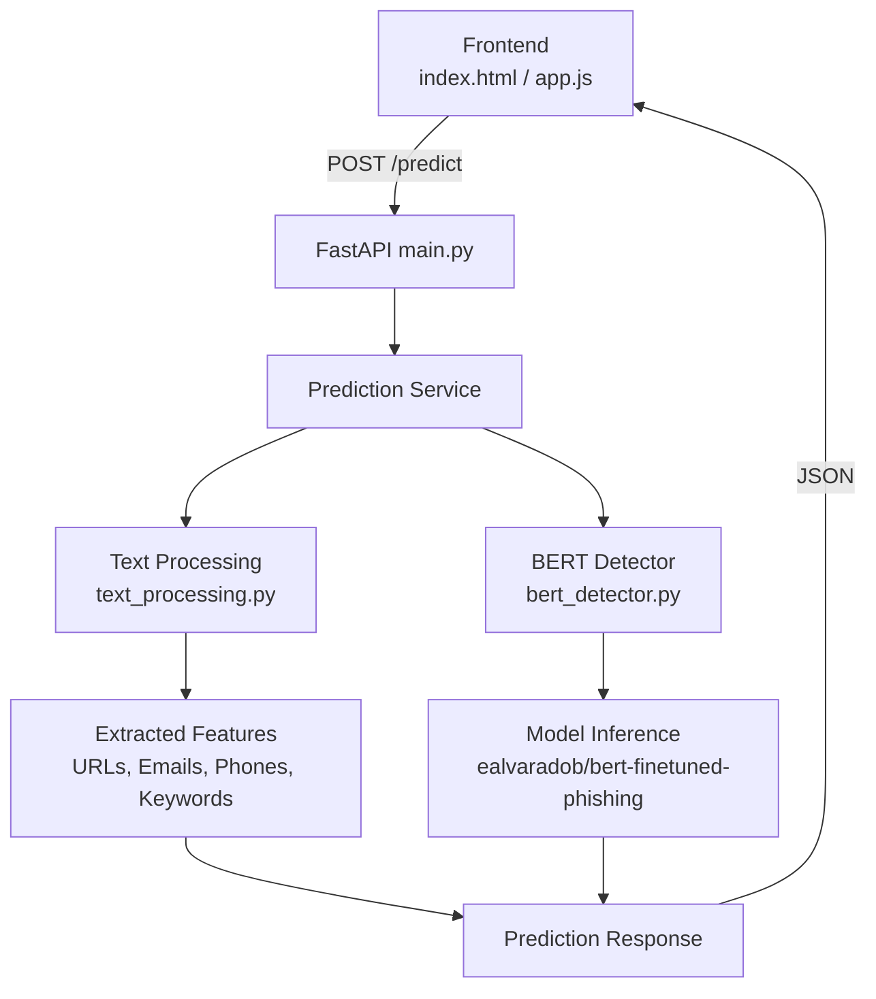
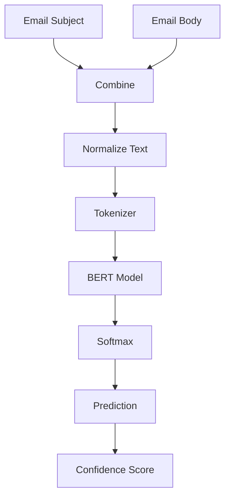

<p align="center">
  
</p>

<div align="center">

# 🛡️ Email Phishing Detection NLP

**AI-powered email phishing detection system using a fine-tuned BERT transformer model**


</div>

---

## Table of Contents

- [Why This Project](#why-this-project)
- [Overview](#overview)
- [Project Highlights](#project-highlights)
- [Features](#features)
- [Architecture](#architecture)
- [Inference Pipeline](#inference-pipeline)
- [Folder Structure](#folder-structure)
- [Technology Stack](#technology-stack)
- [Requirements](#requirements)
- [Installation](#installation)
- [API Documentation](#api-documentation)
- [Model Information](#model-information)
- [Performance](#performance)
- [Intended Use](#intended-use)
- [Future Work](#future-work)
- [Contributing](#contributing)
- [License](#license)
- [Acknowledgements](#acknowledgements)
- [Author](#author)

---

## Why This Project

Phishing remains one of the most frequent and costly cyber-attacks organizations face today. Traditional rule-based and keyword filters struggle against these attacks because they rely on static patterns rather than understanding meaning. Transformer models like BERT process language contextually, allowing them to recognize social engineering cues, urgency framing, and manipulation tactics that keyword matching misses. This project explores how a fine-tuned BERT model can be integrated into a practical, API-driven detection pipeline rather than treated as an isolated notebook experiment. The goal is to demonstrate end-to-end system design: from raw email text to a served, explainable prediction.

## Overview

This project is an AI-powered Email Phishing Detection System built with Natural Language Processing and a fine-tuned BERT transformer model. Users submit an email subject and body, and the system returns a phishing/legitimate classification, a confidence score, class probabilities, and supporting text analysis features (URLs, extracted emails, phone numbers, urgent keywords, and suspicious phrases).

> **Pretrained Model:** https://huggingface.co/ealvaradob/bert-finetuned-phishing

> **Live Demo:** https://email-phishing-detection-nlp.netlify.app/

## Project Highlights

- 🤖 Fine-tuned BERT transformer for phishing email classification
- ⚡ RESTful API built with FastAPI
- 🔍 NLP-based feature extraction for URLs, emails, phone numbers, and suspicious phrases
- 📊 Confidence scoring with class probabilities
- 🎨 Lightweight responsive frontend built with HTML, CSS, and JavaScript
- 🧩 Modular backend architecture for easy extension

## Demo

**Live Application:** https://email-phishing-detection-nlp.netlify.app/

> Add a short screen recording as `docs/demo.gif` after deployment.


## Features

- ✔ BERT-based phishing detection
- ✔ Confidence score for each prediction
- ✔ REST API built with FastAPI
- ✔ Class probability breakdown (phishing vs. legitimate)
- ✔ Automated feature extraction (URLs, emails, phone numbers)
- ✔ Urgent keyword detection
- ✔ Suspicious phrase detection
- ✔ Text preprocessing pipeline
- ✔ Responsive vanilla JS frontend
- ✔ Built-in sample email testing

## Architecture



## Inference Pipeline



## Folder Structure

The repository is organized into separate backend and frontend components to keep model inference, API logic, and user interface concerns modular.

```text
Email-Phishing-Detection-NLP
│
├── backend
│   ├── models
│   │   ├── bert_detector.py
│   │   └── request_models.py
│   ├── services
│   │   └── prediction_service.py
│   ├── utils
│   │   └── text_processing.py
│   ├── config.py
│   ├── main.py
│   └── requirements.txt
│
├── frontend
│   ├── index.html
│   ├── app.js
│   └── style.css
│
├── README.md
└── LICENSE
```

## Technology Stack

| Category | Technology |
|---|---|
| Language | Python 3.10+ |
| Backend | FastAPI |
| ML Framework | PyTorch |
| NLP | Hugging Face Transformers |
| Validation | Pydantic |
| Server | Uvicorn |
| Frontend | HTML5, CSS3, JavaScript |
| Model | BERT Fine-tuned for Phishing Detection |

## Requirements

- Python 3.10 or later
- pip
- Internet connection (required only for the first model download)
- Modern web browser

> The first startup downloads the pretrained model from Hugging Face. Depending on your internet connection, this may take a few minutes. Subsequent runs use the locally cached model automatically.

## Installation

```bash
# Clone the repository
git clone https://github.com/ShadyNights/Email-Phishing-Detection-NLP.git
cd Email-Phishing-Detection-NLP/backend

# Create and activate a virtual environment
python -m venv venv
source venv/bin/activate      # On Windows: venv\Scripts\activate

# Install dependencies
pip install -r requirements.txt

# Run the FastAPI server
python main.py
# Server runs at http://localhost:8000
```

To run the frontend, open `frontend/index.html` directly in a browser, or serve it with any static file server. Ensure the API base URL in `app.js` points to your running backend instance.

## Live Demo

The application is deployed on Netlify and can be accessed here:

**https://email-phishing-detection-nlp.netlify.app/**

> The deployed application demonstrates the user interface. Model inference requires the FastAPI backend to be running or deployed with the frontend.

## API Documentation

Interactive documentation is generated automatically by FastAPI:

- **Swagger UI:** `http://localhost:8000/docs`
- **ReDoc:** `http://localhost:8000/redoc`

### `GET /`
Health check endpoint. Returns API status and model load state.

**Response**
```json
{
  "status": "healthy",
  "message": "API is running",
  "model_loaded": true,
  "version": "1.0.0"
}
```

### `POST /predict`
Submits an email for phishing classification.

**Request**
```json
{
  "subject": "Urgent: Account Verification Required",
  "body": "Dear Customer, your account has been flagged for suspicious activity. Please verify immediately by clicking the link below."
}
```

**Response**
```json
{
  "is_phishing": true,
  "confidence": 0.9821,
  "prediction_class": "PHISHING",
  "model_info": {
    "model_name": "ealvaradob/bert-finetuned-phishing",
    "accuracy": "97.17",
    "precision": "96.58",
    "recall": "96.70"
  },
  "analysis_details": {
    "text_length": 132,
    "word_count": 21,
    "has_urls": true,
    "url_count": 1,
    "urgent_keywords_count": 2,
    "suspicious_patterns_count": 1
  }
}
```

### `GET /model_info`
Returns metadata about the loaded model.

**Response**
```json
{
  "model_name": "ealvaradob/bert-finetuned-phishing",
  "model_type": "BERT Fine-tuned for Phishing Detection",
  "accuracy": "97.17",
  "precision": "96.58",
  "recall": "96.70",
  "false_positive_rate": "2.49",
  "supported_languages": ["English"],
  "max_text_length": 512
}
```

## Model Information

| Property | Value |
|---|---|
| Model | [`ealvaradob/bert-finetuned-phishing`](https://huggingface.co/ealvaradob/bert-finetuned-phishing) |
| Base Architecture | BERT (fine-tuned) |
| Task | Binary sequence classification (Phishing / Legitimate) |
| Maximum Sequence Length | 512 tokens |
| Output Layer | Softmax over 2 classes |
| Confidence Metric | Maximum Softmax Probability |
| Framework | Hugging Face Transformers + PyTorch |

This project uses the publicly available pretrained phishing classification model published by **ealvaradob** on Hugging Face. The repository focuses on integrating the model into a complete phishing detection system, including API development, NLP preprocessing, feature extraction, and frontend integration, rather than training or fine-tuning the underlying model.

## Performance

The following metrics are taken from the published evaluation of the pretrained model used in this project. They are provided for reference and may differ when evaluated on different datasets or deployment environments.

| Metric | Value |
|---|---:|
| Accuracy | 97.17% |
| Precision | 96.58% |
| Recall | 96.70% |
| False Positive Rate | 2.49% |

## Intended Use

This project demonstrates how transformer-based NLP models can be integrated into a phishing detection pipeline. It is intended for educational purposes, experimentation, and as a foundation for further development. Production email security systems should combine multiple detection layers, including authentication checks, sender reputation, attachment scanning, and network-based protections.

## Future Work

### Detection Improvements

- [ ] Sender reputation analysis
- [ ] Domain reputation scoring
- [ ] URL reputation lookup
- [ ] Attachment malware scanning
- [ ] Explainable AI (Attention Maps / SHAP)
- [ ] Multi-language phishing detection

### Engineering

- [ ] Docker support
- [ ] Docker Compose deployment
- [ ] CI/CD pipeline
- [ ] Automated unit and integration testing
- [ ] Cloud deployment (AWS / Azure / Google Cloud)
- [ ] Kubernetes deployment

### User Experience

- [ ] Interactive analytics dashboard
- [ ] Drag-and-drop email (.eml) upload
- [ ] Batch email analysis
- [ ] Dark mode
- [ ] Export analysis reports

## Contributing

Contributions are welcome. To contribute:

1. Fork the repository.
2. Create a feature branch (`git checkout -b feature/your-feature`).
3. Commit your changes with clear messages.
4. Open a pull request describing the change and its motivation.

Please open an issue first for significant changes to discuss scope and design.

## License

This project is licensed under the [MIT License](LICENSE).

## Acknowledgements

This project builds upon several outstanding open-source technologies:

- **Hugging Face** — Transformers library and model hosting.
- **PyTorch** — Deep learning framework.
- **FastAPI** — High-performance Python web framework.
- **ealvaradob** — Author of the pretrained phishing detection model used by this project.

---

## Author

**Kashif Ansari**

[](https://github.com/ShadyNights)
[](https://www.linkedin.com/in/kashifansari18)

</div>
